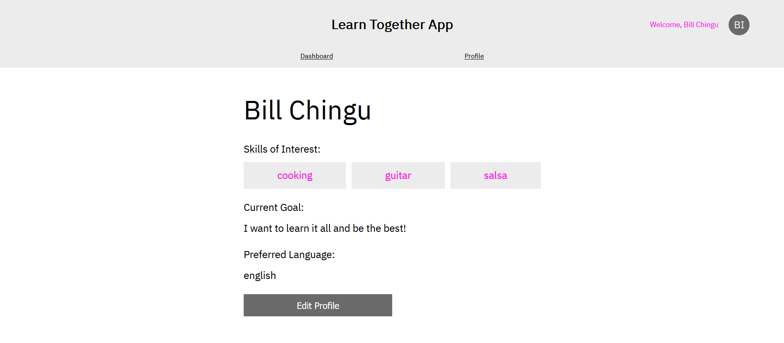

# Learn Together

>  We help you connect with people interested in learning the things you want to learn. 

## Table of Contents

- [Motivation](#motivation)
- [Description](#description)
- [Screenshots](#screenshots)
- [Demo](#demo)
- [Installation](#installation)
- [Technology](#technology)
- [Features](#features)
- [Team](#team)
- [License](#license)

## Motivation

> We believe that learning a new skill, practicing a hobby, or delving into deep learning on a topic is better together.

## Description

> Learn together connects self-learners and autodidacts who share similar interests. After creating their profile, users receive a curated list of recommended learning partners whom they can contact using the in-app email feature. 

## Demo
> [Live App](https://learn-together-v32.herokuapp.com/)

## Screenshots

- Landing


- Dashboard


- Profile


- Edit Profile


- Send Email

---

## Installation

### Clone

- Use Git and the following web url to clone this repo: `https://github.com/chingu-voyages/v32-bears-team-08.git`

### Setup

> Install node packages in backend. From the root, navigate to the backend folder and run the `npm install` command:

```shell
cd backend
$ npm install 
```

>Install node packages for frontend. From the root, navigate to the frontend folder and run the `npm` install command:

```shell
cd frontend
$ npm install
```

### Run Locally

- After backend and frontend packages are installed, you can run the application locally.

> Start the backend server on default port 5000. From the root, navigate to the backend folder and run the `npm start` command. 

```shell
cd backend
$ npm run start
```

> Start the frontend server on default port 3000. From the root, navigate to the backend folder and run the `npm start` command.

```shell
cd frontend
$ npm run start
```

---

# Technology

 - React
 - Express
 - Postgres
 - Node.js

## Features

- JWT authentication
- Create and update user profiles
- Autocomplete assistance
- Generate custom learning partner recommendations
- Send email to recommended learning partner within the app


## Team
<a href="https://github.com/alatruwe"></a>
<a href="https://github.com/ArunJose"></a>
<a href="https://github.com/a-w-m"></a>
<a href="https://github.com/djdenney"></a>
<a href="https://github.com/llndklzr"></a>

---

## License

[](http://badges.mit-license.org)

- **[MIT license](http://opensource.org/licenses/mit-license.php)**
